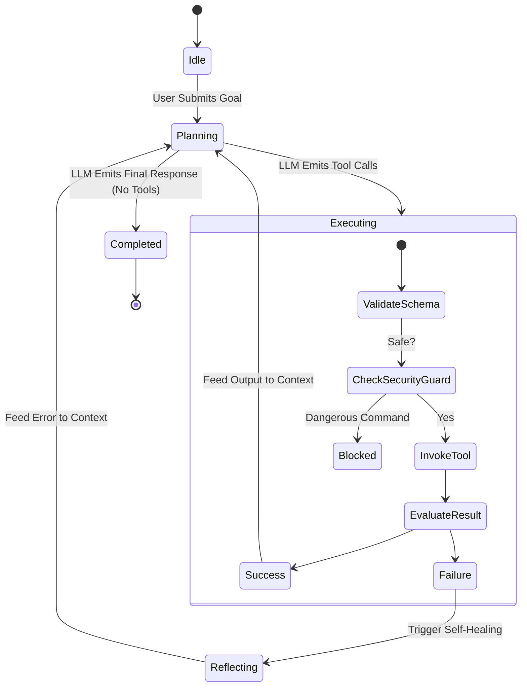

# Nexus-Agent Architecture Specification

This document details the architectural principles, subsystems, and execution lifecycle of **Nexus-Agent**.

---

## 1. High-Level Design Principles

1. **Self-Healing Loop**: Rather than aborting or throwing raw exceptions to the user, every execution failure is piped back into the agent's observation context as a prompt for root cause analysis and corrective action.
2. **Deterministic Pre-Validation**: Python code modifications are parsed using Python's native Abstract Syntax Tree (`ast.parse`) before writing to disk. Broken syntax is rejected immediately at the tool layer.
3. **Dual UX Synergy**: The system provides both a zero-overhead CLI with Rich terminal formatting and a real-time reactive Web dashboard using FastAPI WebSockets.
4. **Offline Determinism**: The `DeterministicMockProvider` enables continuous integration and regression testing without external API dependencies or token expenses.

---

## 2. State Machine and Execution Flow

---

## 3. Subsystem Breakdown

### 3.1. AST-Aware Code Modification (`nexus_agent/tools/file_ops.py`)
Traditional AI agents generate code and write it blindly to the filesystem, often generating syntax errors, mismatched brackets, or invalid indentation.
Nexus-Agent intercepts file writes and edits:
- Compiles the content using `ast.parse(content, filename=...)`.
- If a `SyntaxError` is caught, the tool execution fails gracefully with the line number and syntax explanation, prompting the agent to self-heal before the file is touched on disk.

### 3.2. Sandboxed Shell Execution (`nexus_agent/tools/shell_ops.py`)
- Regex interceptors scan for destructive patterns (`rm -rf /`, formatting drives, fork bombs).
- Execution is strictly bounded by a configurable timeout (default 30 seconds) to prevent hanging processes.
- Captures separate STDOUT, STDERR, and process return codes.

### 3.3. Hierarchical Memory Architecture (`nexus_agent/core/memory.py`)
- **Working Memory**: In-memory token sliding window that maintains conversation history while ensuring the initial system instructions are never evicted.
- **Persistent Knowledge Store**: SQLite database maintaining:
  - `knowledge_items`: Key-value domain facts and conventions.
  - `reflection_journal`: Structured incident log recording `error_signature`, `root_cause`, and `remedy` for anti-regression learning.

### 3.4. Dual Interface System (`nexus_agent/ui/`)
- **Rich TUI CLI**: Built with `click` and `rich`, featuring custom cyberpunk ASCII art, execution spinners, and syntax-highlighted diffs.
- **Mission Control Web Dashboard**: Powered by `fastapi` and `uvicorn`, streaming real-time JSON event packets via WebSocket to a standalone HTML5/Tailwind Glassmorphism frontend with zero npm/node compilation requirements.
