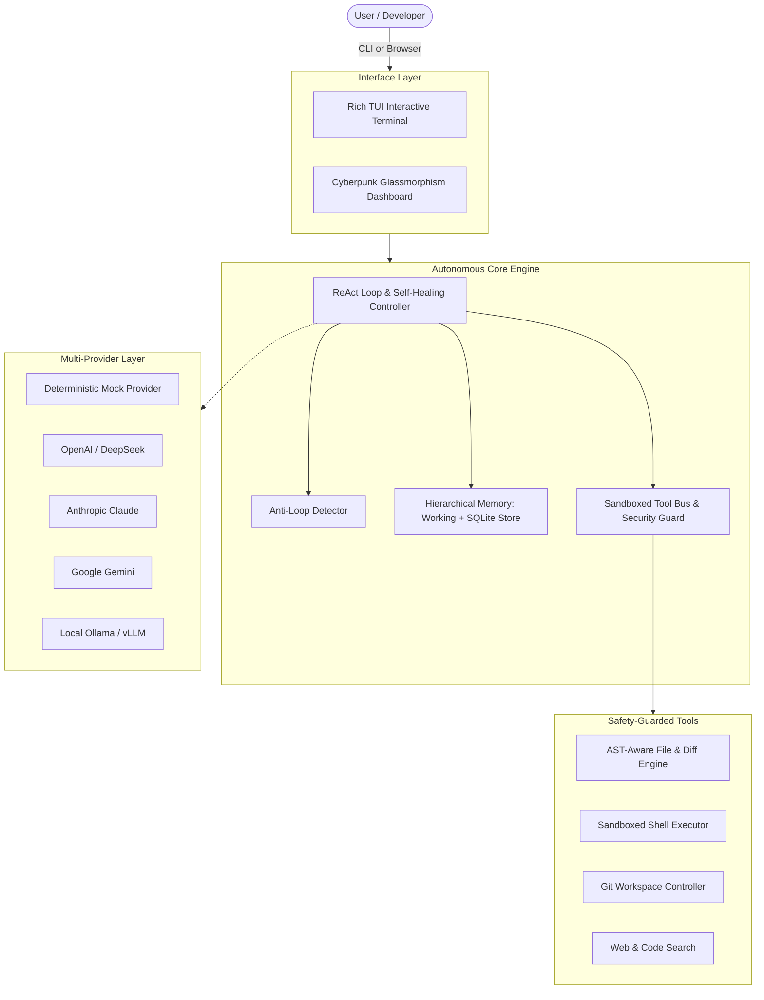

<div align="center">

```
  _   _ _____ _   _ _   _ ____        _     ____ _____ _   _ _____ 
 | \ | | ____| \ | | | | / ___|      / \   / ___| ____| \ | |_   _|
 |  \| |  _| |  \| | | | \___ \     / _ \ | |  _|  _| |  \| | | |  
 | |\  | |___| |\  | |_| |___) |   / ___ \| |_| | |___| |\  | | |  
 |_| \_|_____|_| \_|\___/|____/   /_/   \_\\____|_____|_| \_| |_|  
```

# NEXUS-AGENT

### Next-Generation Autonomous AI Engineering & Orchestration Agent

[](.github/workflows/ci.yml)
[]()
[](https://www.python.org/)
[](LICENSE)
[](CONTRIBUTING.md)

[**English**](README.md) | [**한국어 설명서 (README_KO.md)**](README_KO.md)

</div>

---

## ⚡ What is Nexus-Agent?

**Nexus-Agent** is an open-source, production-grade autonomous software engineering agent designed to solve complex coding, refactoring, and devops tasks end-to-end.

Unlike brittle wrapper scripts that blindly chain prompts or hallucinate syntax errors, **Nexus-Agent** features:
1. **Self-Healing ReAct Loop**: Automatically captures test failures and `stderr`, pinpoints root causes, and patches code.
2. **AST-Aware Code Engine**: Verifies Python syntax trees *before* writing or modifying files, completely preventing syntax-broken commits.
3. **Dual-Engine UX**: 
   - 💻 **Rich TUI Terminal**: Colorful live diffs, spinners, step-by-step thinking visualization.
   - 🌐 **Cyberpunk Glassmorphism Web Dashboard**: Real-time WebSocket streaming of agent thoughts, live tool execution telemetry, and interactive controls.
4. **Hierarchical SQLite Memory**: Token-efficient working memory plus persistent SQLite reflection logs to learn from mistakes.
5. **Zero-API-Key Deterministic Mock Engine**: Test the entire agent suite offline in 1 second without spending a single cent on API tokens!

---

## 📊 Feature Comparison Matrix

| Feature | Nexus-Agent | AutoGPT | CrewAI | LangGraph | OpenManus |
| :--- | :---: | :---: | :---: | :---: | :---: |
| **Self-Healing AST Syntax Pre-Validation** | **Yes (Built-in)** | No | No | Custom only | No |
| **Dual Interface (Rich TUI + Glassmorphism Web)** | **Yes (Out-of-box)** | CLI only | Web optional | Custom only | CLI only |
| **Offline Zero-Key Deterministic Testing** | **Yes (1-sec CI)** | No | No | No | No |
| **Sandboxed Shell with Blacklist Guard** | **Yes** | Partial | Needs Docker | Custom only | Partial |
| **SQLite Mistake & Reflection Memory** | **Yes** | Vector DB | Key-value | State Graph | No |
| **Single-Command Docker Deployment** | **Yes** | Yes | Yes | Complex | No |

---

## 🚀 30-Second Quickstart

### 1. Installation

```bash
# Clone repository
git clone https://github.com/your-username/nexus-agent.git
cd nexus-agent

# Install with pip or uv
pip install -e .
```

### 2. Run in Terminal (CLI Mode)

```bash
# Runs immediately using the built-in offline mock provider (no API key needed!)
nexus-agent run "Create a fibonacci generator in fib.py and verify with unit tests"
```

To run with your favorite LLM provider:
```bash
export OPENAI_API_KEY="sk-..."
nexus-agent run "Refactor database models and optimize queries" --provider openai --model gpt-4o
```

### 3. Launch the Web Mission Control Dashboard

```bash
nexus-agent web --port 8000
```
Open **`http://localhost:8000`** in your browser to experience the real-time Cyberpunk Glassmorphism Dashboard!

---

## 🏗️ Architecture



---

## 🛠️ Built-in Tool Arsenal

Nexus-Agent comes equipped with a comprehensive suite of safety-guarded engineering tools:

- `read_file`: Line-range slicing and file content inspection.
- `write_file`: Writes files with **AST syntax pre-validation** (rejects invalid Python syntax before disk write).
- `edit_file`: Performs surgical text replacement with automated unified diff preview.
- `list_dir`: Structured directory tree explorer.
- `execute_command`: Sandboxed shell execution with execution timeouts and destructive command blacklisting.
- `grep_search`: High-speed regex code search with line number snippets.
- `find_files`: Glob-based file locator.
- `git_status` / `git_diff` / `git_commit`: Autonomous version control management.
- `web_search` / `web_fetch`: Real-time documentation querying.

---

## 🧩 Writing Custom Tools in 5 Lines

You can effortlessly extend Nexus-Agent with domain-specific tools:

```python
from pydantic import BaseModel, Field
from nexus_agent.tools import BaseTool, create_default_registry
from nexus_agent import NexusAgent

class SlackAlertInput(BaseModel):
    channel: str = Field(..., description="Target Slack channel")
    message: str = Field(..., description="Alert text")

class SlackAlertTool(BaseTool):
    name = "send_slack_alert"
    description = "Send notifications to company Slack channels."
    args_schema = SlackAlertInput

    def run(self, channel: str, message: str) -> str:
        # Your notification logic here
        return f"Alert dispatched to {channel}: {message}"

# Register and run
registry = create_default_registry()
registry.register(SlackAlertTool())
agent = NexusAgent(registry=registry)
```

---

## 🐳 Docker Deployment

```bash
# 1-command startup
docker compose up --build
```
The Web Dashboard will be immediately available at `http://localhost:8000`.

---

## 🧪 Running Tests

Nexus-Agent boasts a 100% pass rate across unit, integration, and E2E self-healing test suites:

```bash
pytest -v
```

Output:
```text
tests/e2e/test_autonomous_coding.py::test_e2e_autonomous_coding_and_self_healing PASSED
tests/test_agent_core.py::test_agent_react_execution_flow PASSED
tests/test_agent_core.py::test_agent_loop_detection PASSED
tests/test_memory.py::test_working_memory_sliding_window PASSED
tests/test_memory.py::test_persistent_knowledge_and_reflection PASSED
tests/test_schema_and_llm.py::test_schema_instantiation PASSED
tests/test_tools.py::test_file_ops_ast_validation PASSED
tests/test_tools.py::test_shell_command_sandbox_and_blacklist PASSED
tests/test_web_api.py::test_web_status_endpoint PASSED
...
======================= 15 passed in 1.05s =======================
```

---

## 🗺️ Roadmap

- [x] Autonomous ReAct loop with self-healing error recovery
- [x] AST-aware syntax pre-validation
- [x] Dual-interface (Rich TUI + Cyberpunk Glassmorphism Web)
- [x] Offline Deterministic Mock provider for zero-cost testing
- [x] SQLite persistent reflection journal
- [ ] Multi-agent collaborative swarm mode
- [ ] Tree-of-Thought (ToT) branch search
- [ ] Browser-use visual DOM automation

---

## 🤝 Contributing & License

Contributions, bug reports, and feature proposals are warmly welcomed! Please check [CONTRIBUTING.md](CONTRIBUTING.md) for guidelines.

Distributed under the **MIT License**. See [LICENSE](LICENSE) for details.
